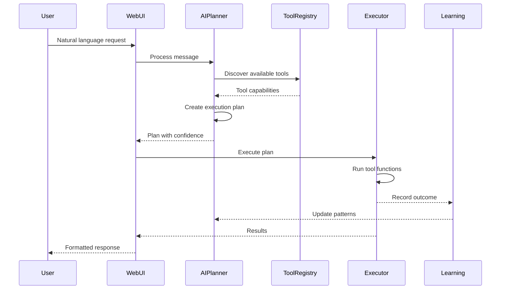

# AI-First Architecture Documentation

## Overview

The Intelligent Crawl4AI Agent uses a revolutionary AI-first architecture where **every single decision** flows through AI planning. There are no hardcoded if/else chains, no keyword matching, and no predetermined workflows.

## Core Principles

### 1. **Zero Hardcoded Logic**
```python
# ❌ OLD WAY - Rule-based
if 'scrape' in message:
    if 'product' in message:
        use_product_strategy()
    elif 'contact' in message:
        use_contact_strategy()

# ✅ NEW WAY - AI-first  
plan = await ai_planner.create_plan(message)
result = await executor.execute_plan(plan)
```

### 2. **Natural Language Understanding**
Users communicate in plain English. The AI understands intent, context, and requirements without needing specific keywords or formats.

### 3. **Self-Discovering Tools**
Tools register themselves with the system. The AI discovers available capabilities and decides how to use them.

### 4. **Continuous Learning**
Every execution teaches the system. Success patterns are remembered, failures are analyzed, and performance continuously improves.

## Architecture Components

### 🧠 AI Planner
The brain of the system that creates execution plans from natural language requests.

**Key Files:**
- `ai_core/enhanced_adaptive_planner.py` - Main planner with learning
- `ai_core/planner.py` - Base planning and execution logic

**How it works:**
1. Receives natural language request
2. Analyzes intent and requirements
3. Discovers available tools
4. Creates JSON execution plan
5. Validates plan feasibility
6. Returns plan with confidence score

### 🔧 Tool Registry
Self-discovering tool system that makes capabilities available to AI.

**Key Files:**
- `ai_core/registry.py` - Tool registration system
- `ai_core/tools/` - Individual tool implementations

**Creating a Tool:**
```python
from ai_core.registry import ai_tool, create_example

@ai_tool(
    name="my_tool",
    description="What this tool does",
    examples=[
        create_example("Example usage", param1="value1")
    ]
)
async def my_tool_function(param1: str, param2: int = 10):
    # Tool implementation
    return {"result": "success"}
```

### 📚 Learning System
Continuously improves AI decision-making through pattern recognition.

**Key Files:**
- `ai_core/learning/memory.py` - Pattern storage in ChromaDB
- `ai_core/learning/trainer.py` - Failure analysis and improvement

**Learning Process:**
1. Store execution patterns (request → plan → outcome)
2. Analyze failures to identify issues
3. Learn from successful patterns
4. Apply learned patterns to similar requests
5. Get teacher feedback for improvements

### ⚡ Execution Engine
Runs AI-generated plans with proper error handling and monitoring.

**Key Files:**
- `ai_core/planner.py` - PlanExecutor class

**Execution Flow:**
1. Receive validated plan from AI
2. Execute steps in order (or parallel when possible)
3. Handle errors gracefully
4. Track performance metrics
5. Report results back to learning system

## Tool Ecosystem

### Available Tools

1. **CrawlTool** (`ai_core/tools/crawler.py`)
   - Web scraping with Crawl4AI
   - Dynamic content handling
   - Session management

2. **DatabaseTool** (`ai_core/tools/database.py`)
   - Store/retrieve data
   - Automatic schema detection
   - Query capabilities

3. **AnalyzerTool** (`ai_core/tools/analyzer.py`)
   - Pattern recognition
   - Data analysis
   - Comparison operations

4. **ExporterTool** (`ai_core/tools/exporter.py`)
   - Export to CSV, JSON, Excel, XML, HTML
   - Formatting options
   - Batch exports

5. **Additional Tools**
   - ExtractorTool - Content extraction
   - WebSearchTool - Semantic search
   - FileSystemTool - File operations
   - APITool - External API calls

### Tool Enhancement System

**Phase 6 Enhancements:**
- **DynamicParameterDiscovery** - AI suggests parameters
- **ToolCombinationEngine** - Optimizes tool pipelines
- **PerformanceProfiler** - Tracks execution metrics
- **CapabilityMatcher** - Semantic tool matching
- **ToolRecommendationEngine** - Suggests new tools

## Request Flow



## Configuration

### AI Models
```bash
# Default model (fast, runs on most hardware)
AI_MODEL=deepseek-coder:1.3b

# Alternative models
AI_MODEL=llama3.2:3b        # Better understanding
AI_MODEL=mistral:7b         # Highest quality
AI_MODEL=phi3:mini          # Smallest/fastest
```

### Learning Configuration
```bash
LEARNING_ENABLED=true       # Enable pattern learning
TEACHER_MODE=false         # Enable Claude teacher
LEARNING_THRESHOLD=0.7     # Minimum confidence to learn
```

### Performance Tuning
```bash
PLAN_CACHE_SIZE=1000       # Cache frequent plans
TOOL_TIMEOUT=30            # Tool execution timeout
MAX_PARALLEL_TOOLS=5       # Concurrent executions
```

## Best Practices

### 1. **Natural Communication**
Let users speak naturally. The AI understands:
- "Get me contact info from these sites"
- "I need to analyze competitor pricing"
- "Export yesterday's data as Excel"

### 2. **Tool Design**
- Make tools focused and single-purpose
- Provide clear descriptions and examples
- Handle errors gracefully
- Return structured data

### 3. **Learning Optimization**
- Let the system fail and learn
- Provide feedback on important failures
- Monitor learning statistics
- Periodically run learning routines

### 4. **Performance**
- Use appropriate AI models for your hardware
- Enable caching for repeated requests
- Monitor tool performance metrics
- Optimize slow tools based on insights

## Debugging

### View AI Planning
```python
# In web_ui_server.py, enable debug logging
logger.setLevel(logging.DEBUG)

# Plans will be logged:
# AI Plan created with 3 steps, confidence: 0.85
# Step 1: crawler.extract_content({...})
# Step 2: analyzer.analyze_data({...})
```

### Learning Inspection
```
GET /api/learning/stats
GET /api/tools/insights
GET /api/tools/recommendations
```

### Common Issues

1. **Low Confidence Plans**
   - Add more examples to tools
   - Improve tool descriptions
   - Check if tools are properly registered

2. **Slow Planning**
   - Use faster AI model
   - Enable plan caching
   - Reduce tool count if unnecessary

3. **Learning Not Improving**
   - Check ChromaDB is running
   - Verify learning is enabled
   - Run manual learning routine

## Future Architecture

### Planned Enhancements

1. **Multi-Model Planning**
   - Use specialized models for different domains
   - Ensemble planning for complex requests

2. **Distributed Execution**
   - Spread tool execution across workers
   - Horizontal scaling for high volume

3. **Advanced Learning**
   - Transfer learning from similar systems
   - Federated learning across deployments

4. **Tool Marketplace**
   - Share tools between deployments
   - Community-contributed tools
   - Automatic tool updates
