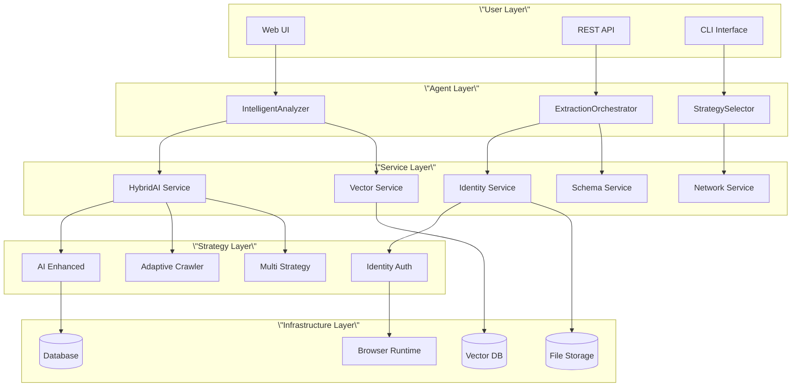
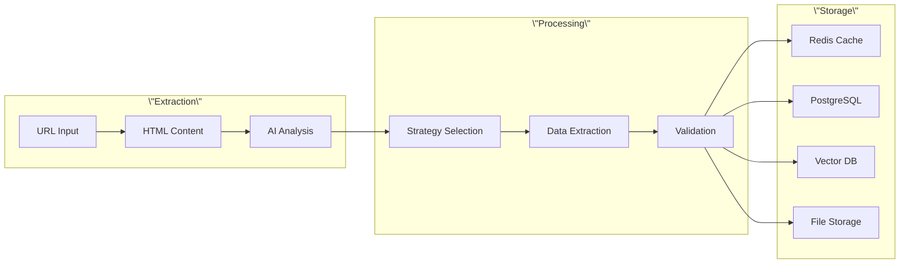

# 🏗️ System Architecture

> **Deep dive into the Intelligent Crawl4AI Agent's technical architecture**

This guide provides a comprehensive overview of the system architecture, service interactions, and design decisions that make the Intelligent Crawl4AI Agent scalable, reliable, and intelligent.

---

## 🎯 Architecture Principles

### **Service-Oriented Design**
- **Modular Services**: Each capability is a separate, testable service
- **Loose Coupling**: Services communicate through well-defined interfaces
- **High Cohesion**: Related functionality grouped within services
- **Dependency Injection**: Services are configurable and mockable

### **AI-First Architecture**
- **Multi-Provider Intelligence**: Never depend on a single AI service
- **Intelligent Routing**: Route requests to optimal AI providers
- **Adaptive Strategies**: Switch extraction approaches based on results
- **Cost Optimization**: Balance quality, speed, and cost automatically

### **Async-Everything**
- **Non-Blocking Operations**: All I/O operations are asynchronous
- **Concurrent Execution**: Multiple extractions run simultaneously
- **Resource Efficiency**: Optimal use of system resources
- **Scalable Performance**: Handles hundreds of concurrent requests

---

## 🏗️ System Overview



---

## ⚙️ Core Service Layer

### **HybridAI Service**
**Purpose**: Multi-provider AI orchestration with intelligent routing

```python
class HybridAIService:
    \"\"\"
    Manages 6 AI providers with automatic failover:
    - DeepSeek (cost-optimized)
    - Groq (speed-optimized) 
    - OpenRouter (model variety)
    - OpenAI (reliability)
    - Anthropic (quality)
    - Ollama (local/private)
    \"\"\"
    
    async def generate_structured(self, prompt: str, schema: Dict) -> Dict:
        # Try providers in priority order
        # Validate output against schema
        # Return best result with confidence score
    
    async def analyze_website_content(self, url: str, html: str, purpose: str) -> Dict:
        # AI-powered website analysis
        # Strategy recommendation
        # Confidence assessment
```

**Key Features**:
- **Priority Routing**: Cheap providers first, premium fallback
- **Health Monitoring**: Real-time provider status tracking
- **Cost Tracking**: Per-provider usage and cost analytics
- **Schema Validation**: Ensure structured outputs match requirements

### **Vector Service**
**Purpose**: Semantic search and similarity matching for content understanding

```python
class VectorService:
    \"\"\"
    Provides semantic search capabilities:
    - Content similarity detection
    - Schema matching
    - Strategy recommendation
    - Pattern recognition
    \"\"\"
    
    async def find_similar_content(self, content: str, limit: int = 10) -> List[Dict]:
        # Generate embeddings
        # Search vector database
        # Return similar content with scores
    
    async def recommend_schema(self, website_type: str, purpose: str) -> Optional[Dict]:
        # Find similar successful extractions
        # Return proven schema patterns
```

### **Identity Service** *(Q1 2025)*
**Purpose**: Authentication and session management for login-protected content

```python
class IdentityService:
    \"\"\"
    Manages authenticated sessions:
    - Profile creation and storage
    - Session persistence
    - Multi-platform authentication
    - Security and compliance
    \"\"\"
    
    async def create_profile(self, platform: str, name: str) -> Profile:
        # Launch headful browser
        # Guide user through login
        # Save encrypted session data
    
    async def validate_session(self, profile: Profile) -> bool:
        # Check session health
        # Refresh if needed
        # Return validity status
```

---

## 🎯 Strategy Architecture

### **Strategy Pattern Implementation**
Each extraction approach is implemented as a strategy with a common interface:

```python
class BaseExtractionStrategy(ABC):
    \"\"\"Base class for all extraction strategies\"\"\"
    
    @abstractmethod
    async def extract(self, url: str, html: str, purpose: str, context: Dict) -> StrategyResult:
        pass
    
    @abstractmethod
    def get_confidence_score(self, url: str, html: str, purpose: str) -> float:
        pass
    
    @abstractmethod
    def supports_purpose(self, purpose: str) -> bool:
        pass
```

### **Strategy Selection Logic**
```python
class StrategySelector:
    \"\"\"Intelligent strategy selection based on context\"\"\"
    
    async def select_optimal_strategy(self, url: str, purpose: str, context: Dict) -> BaseExtractionStrategy:
        # Analyze website characteristics
        # Consider purpose requirements
        # Check strategy confidence scores
        # Return best strategy for the task
        
        factors = {
            'website_complexity': await self._assess_complexity(url),
            'content_type': await self._detect_content_type(url),
            'purpose_requirements': self._analyze_purpose(purpose),
            'historical_performance': await self._get_performance_history(url, purpose)
        }
        
        return self._select_by_factors(factors)
```

### **Available Strategies**

#### **AI-Enhanced Strategy**
- **Use Case**: Complex, dynamic content requiring semantic understanding
- **Approach**: AI analyzes content structure, generates CSS selectors, validates output
- **Confidence**: High for complex sites, medium for simple sites
- **Cost**: Medium (uses AI for analysis and validation)

#### **Adaptive Crawler Strategy** 
- **Use Case**: Similar sites where patterns can be learned
- **Approach**: Learns from successful extractions, adapts to changes
- **Confidence**: High for known patterns, low for new sites
- **Cost**: Low (reuses learned patterns)

#### **Multi-Strategy Coordination**
- **Use Case**: Critical extractions requiring maximum reliability
- **Approach**: Runs multiple strategies, combines results via consensus
- **Confidence**: Very high (multiple validation sources)
- **Cost**: High (multiple strategy execution)

#### **Identity Authentication Strategy** *(Q1 2025)*
- **Use Case**: Login-protected content requiring authentication
- **Approach**: Uses persistent profiles to access authenticated content
- **Confidence**: High for supported platforms
- **Cost**: Medium (session management overhead)

---

## 🔄 Orchestration Layer

### **Workflow Engine**
```python
class ExtractionOrchestrator:
    \"\"\"
    Coordinates complex, multi-step extraction workflows
    \"\"\"
    
    async def create_workflow(self, instruction: str) -> Workflow:
        # Parse natural language instruction
        # Generate step-by-step plan
        # Identify dependencies
        # Return executable workflow
        
    async def execute_workflow(self, workflow: Workflow) -> WorkflowResult:
        # Execute steps in optimal order
        # Handle errors and retries
        # Coordinate data flow between steps
        # Return consolidated results
```

### **Dependency Resolution**
```python
class WorkflowExecutor:
    \"\"\"Handles workflow step execution and dependency management\"\"\"
    
    async def execute_steps(self, steps: List[WorkflowStep]) -> Dict[int, StepResult]:
        # Build dependency graph
        dependency_graph = self._build_dependency_graph(steps)
        
        # Execute steps in topological order
        results = {}
        for step_batch in self._get_execution_batches(dependency_graph):
            # Execute independent steps concurrently
            batch_results = await asyncio.gather(*[
                self._execute_step(step, results) for step in step_batch
            ])
            results.update(batch_results)
        
        return results
```

---

## 💾 Data Layer

### **Storage Architecture**
```python
# Multi-tier storage strategy
├── Hot Storage (Redis)          # Active sessions, cache, real-time data
├── Warm Storage (PostgreSQL)    # Schemas, profiles, analytics
├── Cold Storage (S3/MinIO)      # Raw HTML, archives, backups
└── Vector Storage (Qdrant)      # Embeddings, similarity search
```

### **Data Flow**


### **Schema Management**
```python
class SchemaService:
    \"\"\"Manages extraction schemas and patterns\"\"\"
    
    async def save_successful_schema(self, schema: Dict, metadata: Dict) -> str:
        # Store schema with performance metrics
        # Index by website type and purpose
        # Enable similarity search
        
    async def find_matching_schema(self, website_type: str, purpose: str) -> Optional[Dict]:
        # Vector search for similar schemas
        # Return best match with confidence score
        
    async def evolve_schema(self, schema_id: str, new_data: Dict) -> Dict:
        # Update schema based on new successful extractions
        # Maintain backward compatibility
        # Version control schema changes
```

---

## ⚡ Performance Architecture

### **Async Concurrency Model**
```python
# Maximum concurrency at every level
├── HTTP Requests         # aiohttp for non-blocking requests
├── AI Provider Calls     # Concurrent multi-provider requests  
├── Database Operations   # asyncpg for async PostgreSQL
├── Vector Operations     # Async Qdrant client
└── File I/O             # aiofiles for async file operations
```

### **Caching Strategy**
```python
class CacheManager:
    \"\"\"Multi-level caching for performance optimization\"\"\"
    
    # L1: In-memory cache (strategy results, AI responses)
    memory_cache: Dict[str, Any] = {}
    
    # L2: Redis cache (session data, frequently accessed schemas)
    redis_cache: Redis
    
    # L3: Database cache (persistent data with TTL)
    db_cache: PostgreSQL
    
    async def get_cached_result(self, cache_key: str) -> Optional[Any]:
        # Check L1 → L2 → L3 in order
        # Return first hit, populate higher levels
        
    async def cache_result(self, cache_key: str, data: Any, ttl: int):
        # Store in appropriate cache level based on size/frequency
        # Implement cache eviction policies
```

### **Resource Management**
```python
class ResourceManager:
    \"\"\"Manages system resources and prevents overload\"\"\"
    
    async def acquire_extraction_slot(self) -> AsyncContextManager:
        # Limit concurrent extractions
        # Prevent memory exhaustion
        # Queue requests during high load
        
    async def manage_ai_provider_load(self, provider: str) -> bool:
        # Track provider response times
        # Implement circuit breaker pattern
        # Auto-scale provider usage
```

---

## 🔒 Security Architecture

### **Authentication & Authorization**
```python
# Multi-layer security model
├── API Authentication    # JWT tokens, API keys
├── Profile Encryption   # AES-256 encrypted login credentials
├── Session Security     # Secure cookie handling, CSRF protection
├── Network Security     # TLS, VPN integration, IP filtering
└── Audit Logging       # Complete activity trails
```

### **Data Protection**
```python
class SecurityManager:
    \"\"\"Handles all security concerns\"\"\"
    
    async def encrypt_profile_data(self, profile_data: Dict) -> str:
        # AES-256 encryption for credentials
        # Key rotation and management
        # Secure key storage (HashiCorp Vault)
        
    async def audit_extraction(self, extraction_request: Dict, result: Dict):
        # Log all extraction activities
        # Include user, timestamp, data accessed
        # Enable compliance reporting
        
    async def validate_compliance(self, extraction_request: Dict) -> bool:
        # Check against ToS compliance rules
        # Validate rate limiting adherence
        # Ensure data governance policies
```

---

## 📊 Monitoring & Observability

### **Metrics Collection**
```python
# Comprehensive monitoring stack
├── Application Metrics   # Prometheus metrics
├── AI Provider Metrics   # Response times, success rates, costs
├── Extraction Metrics    # Confidence scores, strategy performance
├── System Metrics        # CPU, memory, network, disk
└── Business Metrics      # Data quality, user satisfaction
```

### **Health Checks**
```python
class HealthChecker:
    \"\"\"Monitors system health across all components\"\"\"
    
    async def check_ai_providers(self) -> Dict[str, str]:
        # Test each AI provider with sample request
        # Return status: healthy/degraded/unhealthy
        
    async def check_data_services(self) -> Dict[str, str]:
        # Verify database connectivity
        # Test vector service responsiveness
        # Check file storage accessibility
        
    async def check_extraction_pipeline(self) -> Dict[str, str]:
        # End-to-end extraction test
        # Validate all strategies working
        # Confirm data flow integrity
```

---

## 🚀 Deployment Architecture

### **Container Strategy**
```yaml
# Docker Compose for development
version: '3.8'
services:
  crawler:
    build: .
    environment:
      - ENVIRONMENT=development
    depends_on:
      - postgres
      - redis
      - qdrant
      
  vnc-browser:  # Identity features
    image: crawler:identity
    ports:
      - \"5900:5900\"
      - \"6080:6080\"
    volumes:
      - profiles:/app/profiles
      
  postgres:
    image: postgres:15
    environment:
      POSTGRES_DB: crawler
      
  redis:
    image: redis:7-alpine
    
  qdrant:
    image: qdrant/qdrant:latest
```

### **Production Scaling**
```python
# Kubernetes deployment strategy
├── Horizontal Pod Autoscaler    # Scale based on CPU/memory/custom metrics
├── Service Mesh (Istio)         # Traffic management, security, observability  
├── External Secrets Operator   # Secure API key management
├── Persistent Volumes          # Profile and schema storage
└── Network Policies            # Secure inter-service communication
```

---

## 📈 Future Architecture Evolution

### **Planned Enhancements**
- **Event-Driven Architecture**: Kafka for real-time data streaming
- **GraphQL API**: More flexible client-server communication
- **Microservices Split**: Further decomposition for scalability
- **Edge Computing**: Distributed extraction nodes
- **ML Pipeline**: Custom model training and deployment

### **Scalability Roadmap**
- **Multi-Tenant Architecture**: Isolated customer environments
- **Global Distribution**: Multiple regions, edge caching
- **Auto-Scaling**: Dynamic resource allocation
- **Cost Optimization**: Intelligent workload scheduling

---

**Architecture Deep Dives** 📚

Ready to explore specific components? Check out these detailed guides:

- **[Service Layer Details](service-layer/)** - Deep dive into each service
- **[Strategy Implementation](extraction-strategies/)** - How strategies work internally  
- **[Performance Optimization](performance/)** - Scaling and optimization techniques
- **[Security Implementation](../deployment/security/)** - Security controls and compliance

---

This architecture enables the Intelligent Crawl4AI Agent to scale from single extractions to enterprise-grade automation while maintaining reliability, security, and cost efficiency.
