# AI-First Execution Flow Documentation

## Overview

This document explains how the AI-First system processes requests from natural language input to final results. Every decision flows through AI planning with zero hardcoded logic.

## System Architecture Flow

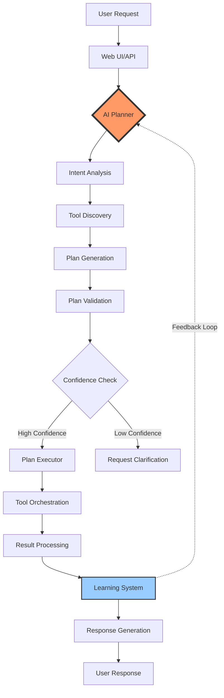

## Detailed Flow Steps

### 1. User Input Processing

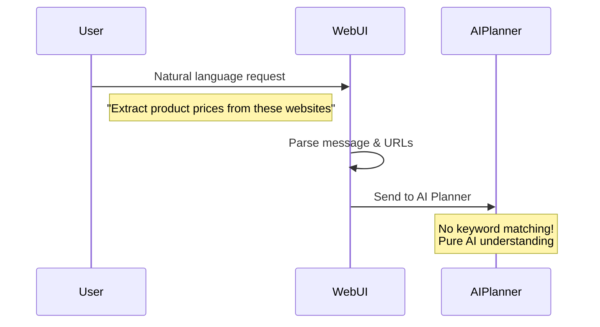

**Example Flow**:
```
User Input: "I need contact information from these company websites"
     ↓
Parsed Data: {
    message: "I need contact information from these company websites",
    urls: ["https://company1.com", "https://company2.com"],
    session_id: "uuid-1234"
}
     ↓
To AI Planner
```

### 2. AI Planning Phase

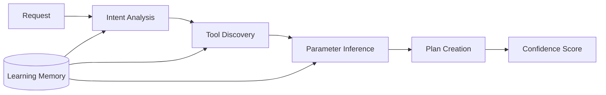

**Internal AI Process**:
```json
{
  "intent_analysis": {
    "primary_intent": "data_extraction",
    "data_type": "contact_information",
    "source_type": "company_websites",
    "complexity": "medium"
  },
  "discovered_tools": [
    "crawler.extract_content",
    "extractor.extract_contact_info",
    "database.store_data"
  ],
  "plan_confidence": 0.92
}
```

### 3. Plan Generation

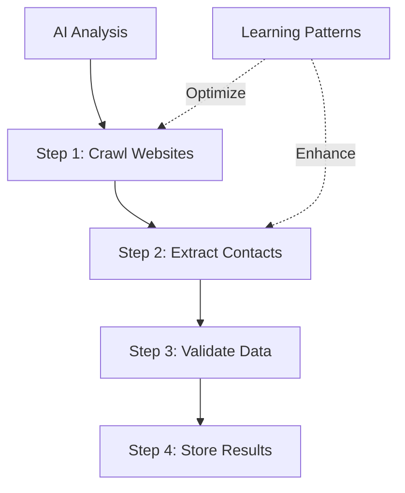

**Generated Plan Structure**:
```json
{
  "plan_id": "plan_20240115_1234",
  "confidence": 0.92,
  "description": "Extract contact information from 2 company websites",
  "steps": [
    {
      "step_id": "s1",
      "tool": "crawler",
      "function": "extract_content",
      "parameters": {
        "urls": ["https://company1.com", "https://company2.com"],
        "extraction_type": "full_content",
        "wait_for_dynamic": true
      },
      "description": "Fetch website content"
    },
    {
      "step_id": "s2",
      "tool": "extractor",
      "function": "extract_contact_info",
      "parameters": {
        "content": "{from_step:s1}",
        "include_social": true
      },
      "description": "Extract contact details"
    },
    {
      "step_id": "s3",
      "tool": "database",
      "function": "store_data",
      "parameters": {
        "table_name": "company_contacts",
        "data": "{from_step:s2}"
      },
      "description": "Save to database"
    }
  ]
}
```

### 4. Plan Execution

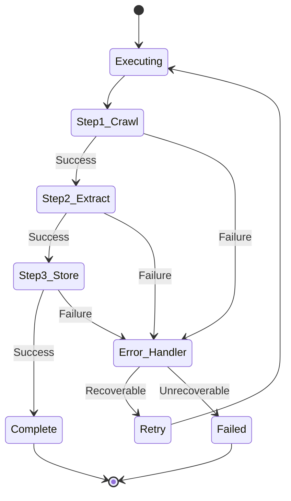

**Execution Monitoring**:
```python
# Real-time execution updates
{
  "execution_id": "exec_1234",
  "current_step": "s2",
  "progress": {
    "completed_steps": 1,
    "total_steps": 3,
    "percentage": 33.3
  },
  "status": "running",
  "elapsed_time": 5.2
}
```

### 5. Tool Orchestration

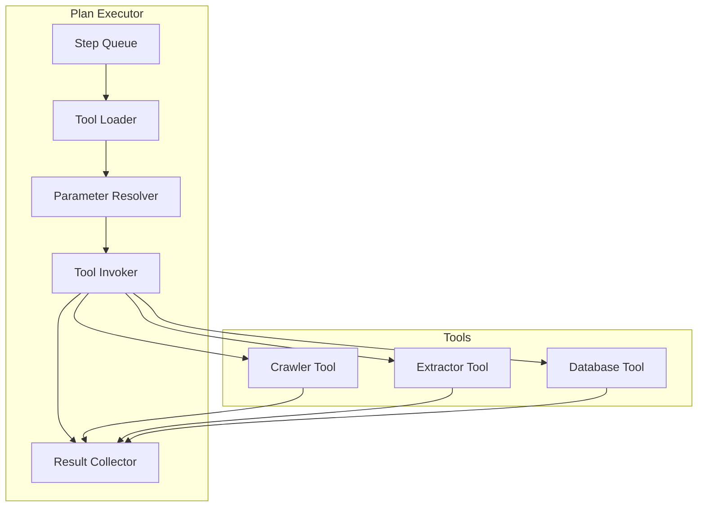

**Tool Invocation Example**:
```python
# Tool: crawler
# Function: extract_content
# Parameters resolved from plan
result = await crawler.extract_content(
    urls=["https://company1.com", "https://company2.com"],
    extraction_type="full_content",
    wait_for_dynamic=True
)

# Result passed to next step
next_params = {"content": result["data"]}
```

### 6. Error Handling Flow

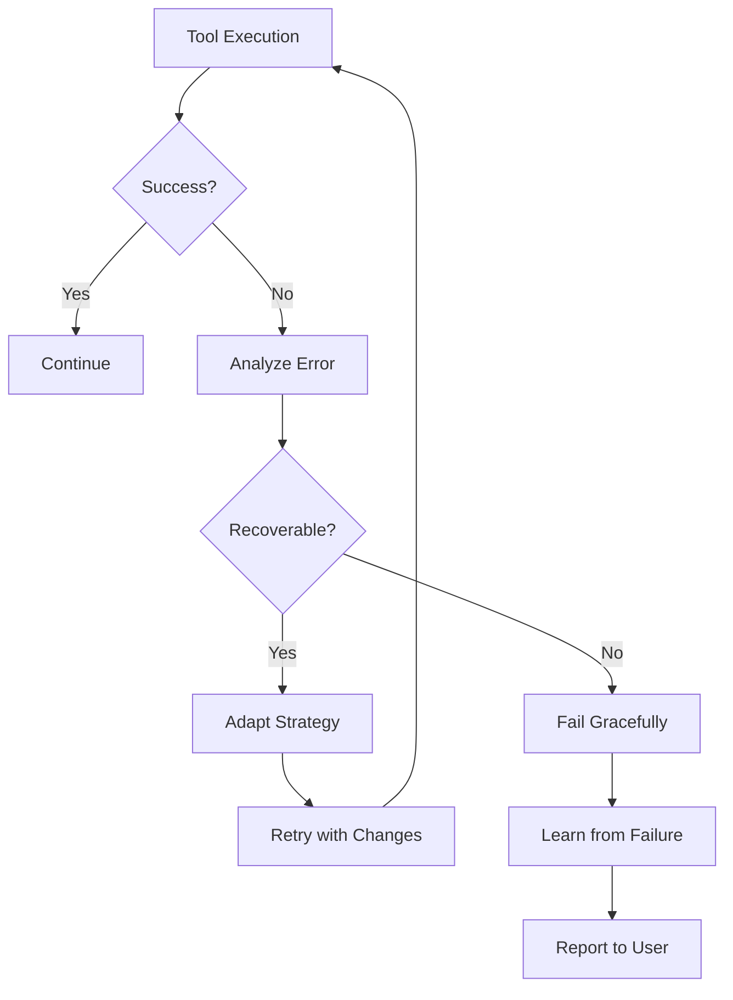

**Error Recovery Example**:
```json
{
  "error": "JavaScript content not loaded",
  "analysis": "Page requires dynamic rendering",
  "adaptation": {
    "original_tool": "crawler.extract_content",
    "new_parameters": {
      "wait_for_dynamic": true,
      "timeout": 30,
      "wait_for_selector": ".content-loaded"
    }
  },
  "retry_attempt": 1
}
```

### 7. Learning Integration

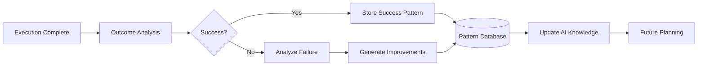

**Learning Record**:
```json
{
  "pattern_id": "pat_contact_extraction_001",
  "request_type": "contact_extraction",
  "success": true,
  "execution_time": 12.5,
  "tool_sequence": ["crawler", "extractor", "database"],
  "parameters_used": {
    "wait_for_dynamic": true,
    "include_social": true
  },
  "confidence_boost": 0.05,
  "reuse_count": 0
}
```

### 8. Response Generation

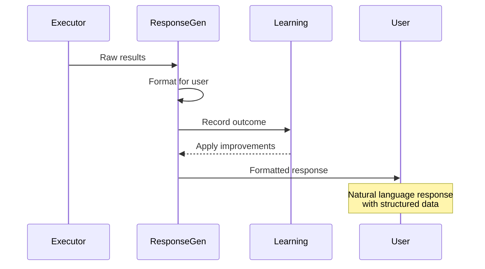

**Response Example**:
```
AI Response:
✅ Successfully extracted contact information from both websites:

**Company 1 (company1.com):**
- Email: contact@company1.com
- Phone: +1 (555) 123-4567
- Address: 123 Business St, City, State 12345
- LinkedIn: linkedin.com/company/company1

**Company 2 (company2.com):**
- Email: info@company2.com
- Phone: +1 (555) 987-6543
- Address: 456 Corporate Ave, City, State 54321
- Twitter: @company2

All data has been saved to the database. Would you like to:
- Export as CSV
- Search for more companies
- View detailed analysis
```

## Parallel Execution Flow

For high-volume operations, the AI orchestrates parallel execution:

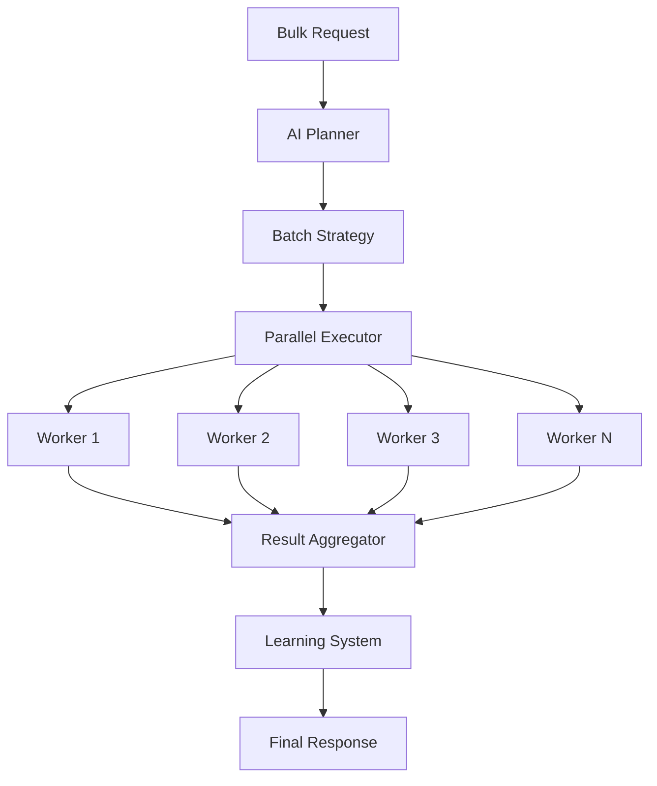

## Performance Optimization Flow

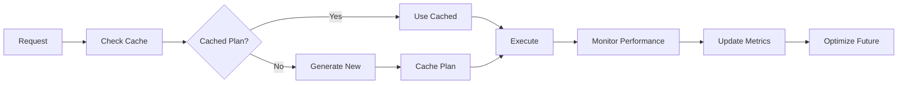

## Complete Request Lifecycle

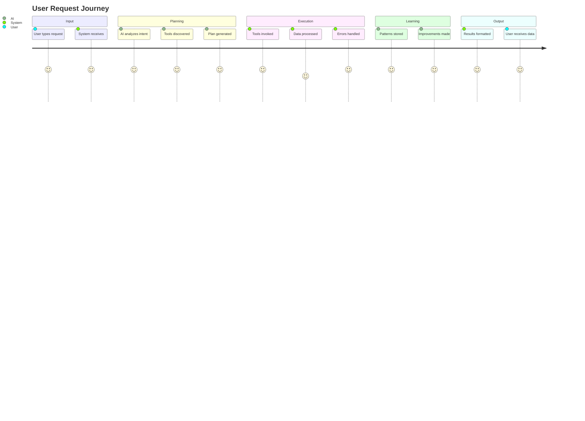

## Key Differences from Traditional Systems

### Old Rule-Based Flow
```
if 'scrape' in message:
    if 'product' in message:
        strategy = ProductStrategy()
    elif 'contact' in message:
        strategy = ContactStrategy()
    # ... hundreds of conditions
```

### New AI-First Flow
```
plan = ai_planner.create_plan(message)
result = executor.execute_plan(plan)
learning.record_outcome(plan, result)
```

## Monitoring & Debugging

### Flow Inspection Points

1. **Planning Phase**
   ```
   LOG: Creating AI plan for: "Extract contact info..."
   LOG: Intent identified: contact_extraction
   LOG: Confidence: 0.92
   ```

2. **Execution Phase**
   ```
   LOG: Executing step 1/3: crawler.extract_content
   LOG: Step 1 completed in 2.3s
   LOG: Executing step 2/3: extractor.extract_contact_info
   ```

3. **Learning Phase**
   ```
   LOG: Recording successful pattern
   LOG: Pattern similarity: 0.87 with existing
   LOG: Updating optimization parameters
   ```

## Summary

The AI-First flow eliminates all hardcoded decision-making. Every request:
1. Gets understood by AI (not keyword matching)
2. Receives a custom execution plan
3. Executes with intelligent error handling
4. Contributes to system learning
5. Improves future performance

This creates a self-improving system that handles any request naturally!
