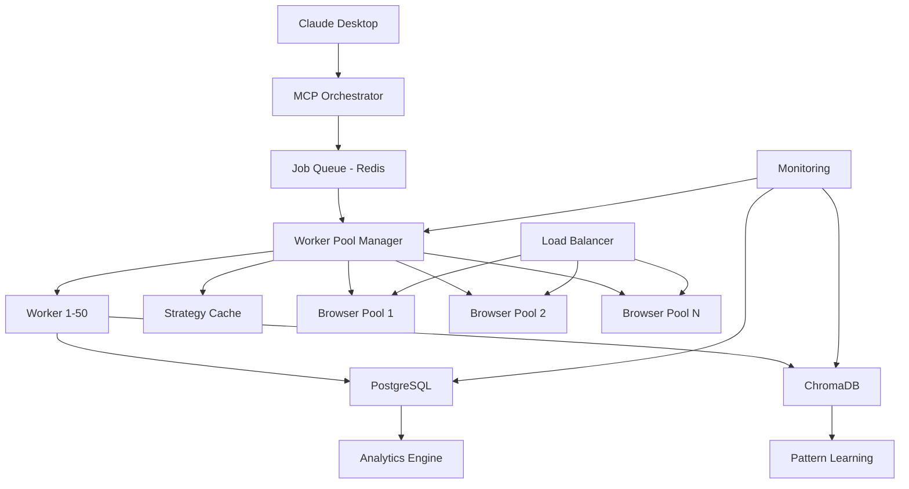

# High-Volume Processing Guide

## Overview

The Intelligent Crawl4AI Agent is designed to handle massive concurrent scraping operations, processing thousands of URLs efficiently with intelligent distribution and optimization. This guide covers high-volume deployment, scaling strategies, and performance optimization.

## Table of Contents

- [Architecture for Scale](#architecture-for-scale)
- [High-Volume Configuration](#high-volume-configuration)
- [Deployment Strategies](#deployment-strategies)
- [Performance Optimization](#performance-optimization)
- [Monitoring and Management](#monitoring-and-management)
- [Scaling Patterns](#scaling-patterns)
- [Resource Planning](#resource-planning)
- [Use Case Examples](#use-case-examples)
- [Troubleshooting Scale](#troubleshooting-scale)

## Architecture for Scale

### High-Volume Components



### Distributed Processing Flow

1. **Job Submission** → Large URL batches queued in Redis
2. **Intelligent Batching** → URLs grouped by similarity and priority
3. **Worker Distribution** → 50+ workers process batches concurrently
4. **Browser Pool Management** → Multiple browser instances with load balancing
5. **Real-time Learning** → Strategy optimization based on success patterns
6. **Result Aggregation** → Data normalized and stored in PostgreSQL
7. **Performance Monitoring** → Real-time metrics and alerting

## High-Volume Configuration

### Production Environment Settings

```bash
# Worker Configuration
MAX_WORKERS=100                    # Number of concurrent workers
MAX_CONCURRENT_PER_WORKER=20      # URLs per worker simultaneously
WORKER_BATCH_SIZE=500             # URLs per batch
QUEUE_BATCH_PRIORITY=true         # Enable priority queuing

# Database Optimization
POSTGRES_POOL_MAX=200             # Database connection pool
POSTGRES_BULK_INSERT_SIZE=1000    # Bulk insert batch size
POSTGRES_VACUUM_FREQUENCY=1h      # Database maintenance

# Browser Pool Scaling
BROWSER_POOL_COUNT=10             # Number of browser pools
BROWSERS_PER_POOL=20              # Browsers per pool (200 total)
BROWSER_SESSION_REUSE=100         # Reuse sessions N times
BROWSER_POOL_ROTATION=true        # Distribute load across pools

# Memory Management
MAX_MEMORY_PER_WORKER=1GB         # Worker memory limit
GARBAGE_COLLECTION_FREQUENCY=50   # GC every N operations
CACHE_EVICTION_POLICY=lru         # Cache management

# Network Optimization
CONNECTION_POOL_SIZE=500          # HTTP connection pool
KEEP_ALIVE_TIMEOUT=300            # Connection keep-alive
DNS_CACHE_SIZE=10000              # DNS resolution cache
```

### Redis Queue Configuration

```bash
# Queue Management
REDIS_MAX_MEMORY=16GB             # Redis memory limit
REDIS_EVICTION_POLICY=allkeys-lru # Memory management
QUEUE_MONITORING=true             # Enable queue metrics

# Job Priority System
HIGH_PRIORITY_QUEUE=urgent_jobs    # Critical jobs
NORMAL_PRIORITY_QUEUE=standard_jobs # Regular jobs  
LOW_PRIORITY_QUEUE=background_jobs  # Non-urgent jobs

# Batch Processing
DYNAMIC_BATCH_SIZING=true         # Adjust batch size based on load
MIN_BATCH_SIZE=50                 # Minimum URLs per batch
MAX_BATCH_SIZE=1000               # Maximum URLs per batch
BATCH_TIMEOUT=300                 # Max time to fill batch
```

## Deployment Strategies

### Single-Machine High-Volume

**For up to 10,000 URLs/hour:**

```yaml
# docker-compose.high-volume.yml
version: '3.9'
services:
  intelligent-agent:
    deploy:
      resources:
        limits:
          cpus: '8.0'
          memory: 16G
        reservations:
          cpus: '4.0'
          memory: 8G
    environment:
      - MAX_WORKERS=50
      - MAX_CONCURRENT_PER_WORKER=15
      - POSTGRES_POOL_MAX=100

  high-volume-workers:
    deploy:
      replicas: 4
      resources:
        limits:
          cpus: '6.0'
          memory: 12G
        reservations:
          cpus: '3.0'
          memory: 6G

  # Additional browser pools
  browser-pool-3:
    image: browserless/chrome:latest
    environment:
      - CONCURRENT=30
    deploy:
      resources:
        limits:
          memory: 4G
```

### Multi-Machine Distributed

**For 50,000+ URLs/hour:**

```yaml
# docker-compose.distributed.yml
version: '3.9'
services:
  # Coordinator Node
  coordinator:
    image: intelligent-crawl4ai:latest
    environment:
      - ROLE=coordinator
      - WORKER_NODES=worker1,worker2,worker3
      - LOAD_BALANCER=nginx
    
  # Worker Nodes (deploy on separate machines)
  worker-node:
    image: intelligent-crawl4ai:latest
    environment:
      - ROLE=worker
      - COORDINATOR_URL=http://coordinator:8811
      - LOCAL_WORKERS=25
    deploy:
      replicas: 4
      placement:
        constraints:
          - node.role == worker

  # Dedicated Database Cluster
  postgres-primary:
    image: postgres:15
    environment:
      - POSTGRES_REPLICATION_MODE=master
    
  postgres-replica:
    image: postgres:15
    environment:
      - POSTGRES_REPLICATION_MODE=slave
      - POSTGRES_MASTER_HOST=postgres-primary
```

### Cloud-Native Kubernetes

```yaml
# k8s-deployment.yml
apiVersion: apps/v1
kind: Deployment
metadata:
  name: intelligent-crawl4ai-workers
spec:
  replicas: 20
  selector:
    matchLabels:
      app: crawl4ai-worker
  template:
    metadata:
      labels:
        app: crawl4ai-worker
    spec:
      containers:
      - name: worker
        image: intelligent-crawl4ai:latest
        resources:
          requests:
            cpu: 500m
            memory: 2Gi
          limits:
            cpu: 2000m
            memory: 4Gi
        env:
        - name: MAX_WORKERS
          value: "10"
        - name: REDIS_URL
          value: "redis://redis-cluster:6379"

---
apiVersion: v1
kind: Service
metadata:
  name: intelligent-crawl4ai-service
spec:
  selector:
    app: crawl4ai-worker
  ports:
  - port: 8811
    targetPort: 8811
  type: LoadBalancer

---
# Horizontal Pod Autoscaler
apiVersion: autoscaling/v2
kind: HorizontalPodAutoscaler
metadata:
  name: crawl4ai-hpa
spec:
  scaleTargetRef:
    apiVersion: apps/v1
    kind: Deployment
    name: intelligent-crawl4ai-workers
  minReplicas: 5
  maxReplicas: 100
  metrics:
  - type: Resource
    resource:
      name: cpu
      target:
        type: Utilization
        averageUtilization: 70
  - type: Resource
    resource:
      name: memory
      target:
        type: Utilization
        averageUtilization: 80
```

## Performance Optimization

### Throughput Optimization

**Target: 2,000+ URLs per minute**

```python
# Optimal Configuration Matrix
PERFORMANCE_CONFIGS = {
    "cpu_optimized": {
        "MAX_WORKERS": 100,
        "MAX_CONCURRENT_PER_WORKER": 10,
        "STRATEGY": "regex_fast_mode",
        "BROWSER_TIMEOUT": 15000
    },
    "memory_optimized": {
        "MAX_WORKERS": 50,
        "MAX_CONCURRENT_PER_WORKER": 20,
        "CACHE_SIZE": 5000,
        "ENABLE_COMPRESSION": True
    },
    "balanced": {
        "MAX_WORKERS": 75,
        "MAX_CONCURRENT_PER_WORKER": 15,
        "SMART_STRATEGY_SELECTION": True,
        "ADAPTIVE_TIMEOUTS": True
    }
}
```

### Strategy Optimization for Scale

```bash
# Fast Extraction Mode
ENABLE_REGEX_FAST_MODE=true        # 20x faster for simple patterns
PREFER_CSS_OVER_LLM=true           # CSS strategies are faster
STRATEGY_CONFIDENCE_THRESHOLD=0.6   # Lower threshold for speed
SKIP_DEEP_ANALYSIS=true            # Skip detailed website analysis

# Caching Strategies
STRATEGY_CACHE_SIZE=10000          # Cache successful strategies
SELECTOR_CACHE_SIZE=50000          # Cache working CSS selectors
DOMAIN_STRATEGY_CACHE=true         # Remember strategies per domain
CACHE_TTL=3600                     # 1 hour cache lifetime

# Parallel Processing
PARALLEL_STRATEGY_TESTING=true     # Test multiple strategies simultaneously
CONCURRENT_EXTRACTIONS=true        # Extract multiple fields in parallel
BATCH_SIMILAR_URLS=true           # Group similar URLs for efficiency
```

### Resource Optimization

```bash
# Memory Management
AGGRESSIVE_GARBAGE_COLLECTION=true
MEMORY_THRESHOLD_WARNING=0.8       # Alert at 80% memory
MEMORY_THRESHOLD_CRITICAL=0.9      # Scale down at 90%
WORKER_MEMORY_LIMIT=2GB            # Per-worker memory limit

# CPU Optimization
CPU_AFFINITY=true                  # Pin workers to CPU cores
NUMA_AWARENESS=true                # NUMA-aware scheduling
PROCESS_PRIORITY=high              # Higher OS priority

# I/O Optimization
ASYNC_IO=true                      # Asynchronous I/O operations
IO_THREAD_POOL_SIZE=100           # I/O thread pool
DATABASE_CONNECTION_POOLING=true   # Pool database connections
```

## Monitoring and Management

### Real-Time Metrics

```bash
# Key Performance Indicators
- URLs processed per minute
- Success rate percentage
- Average extraction time
- Worker utilization
- Memory usage trends
- Database connection usage
- Queue depth and latency
- Error rates by category
```

### Grafana Dashboard Configuration

```json
{
  "dashboard": {
    "title": "High-Volume Crawl4AI Metrics",
    "panels": [
      {
        "title": "Throughput",
        "type": "graph",
        "targets": [
          {
            "expr": "rate(extractions_total[1m])",
            "legendFormat": "URLs per minute"
          }
        ]
      },
      {
        "title": "Success Rate",
        "type": "singlestat",
        "targets": [
          {
            "expr": "rate(extractions_success_total[5m]) / rate(extractions_total[5m])",
            "legendFormat": "Success Rate"
          }
        ]
      },
      {
        "title": "Worker Utilization",
        "type": "heatmap",
        "targets": [
          {
            "expr": "worker_utilization",
            "legendFormat": "Worker {{instance}}"
          }
        ]
      }
    ]
  }
}
```

### Alerting Rules

```yaml
# prometheus-alerts.yml
groups:
- name: crawl4ai-high-volume
  rules:
  - alert: HighErrorRate
    expr: rate(extractions_errors_total[5m]) / rate(extractions_total[5m]) > 0.1
    for: 2m
    labels:
      severity: warning
    annotations:
      summary: High extraction error rate detected
      
  - alert: LowThroughput  
    expr: rate(extractions_total[5m]) < 500
    for: 5m
    labels:
      severity: critical
    annotations:
      summary: Extraction throughput below threshold
      
  - alert: MemoryUsageHigh
    expr: container_memory_usage_bytes / container_spec_memory_limit_bytes > 0.9
    for: 3m
    labels:
      severity: warning
    annotations:
      summary: Container memory usage above 90%

  - alert: QueueBacklog
    expr: redis_queue_length > 10000
    for: 1m
    labels:
      severity: critical
    annotations:
      summary: Large queue backlog detected
```

### Auto-Scaling Configuration

```bash
# Auto-scaling Rules
SCALE_UP_THRESHOLD=0.8             # Scale up at 80% utilization
SCALE_DOWN_THRESHOLD=0.3           # Scale down at 30% utilization
MIN_WORKERS=10                     # Minimum worker count
MAX_WORKERS=200                    # Maximum worker count
SCALE_UP_COOLDOWN=300              # 5 minutes between scale-ups
SCALE_DOWN_COOLDOWN=600            # 10 minutes between scale-downs

# Predictive Scaling
ENABLE_PREDICTIVE_SCALING=true     # Use historical data
PREDICTION_WINDOW=3600             # 1 hour prediction window
SCALE_AHEAD_TIME=600               # Scale 10 minutes early
```

## Scaling Patterns

### Horizontal Scaling

```bash
# Adding Worker Nodes
docker-compose scale high-volume-workers=10

# Kubernetes Scaling
kubectl scale deployment intelligent-crawl4ai-workers --replicas=50

# Auto-scaling based on queue depth
kubectl autoscale deployment intelligent-crawl4ai-workers \
  --cpu-percent=70 \
  --min=10 \
  --max=100
```

### Vertical Scaling

```yaml
# Increase resource limits
services:
  intelligent-agent:
    deploy:
      resources:
        limits:
          cpus: '16.0'        # Double CPU
          memory: 32G         # Double memory
        reservations:
          cpus: '8.0'
          memory: 16G
```

### Geographic Distribution

```bash
# Multi-region deployment
REGIONS=["us-east-1", "us-west-2", "eu-west-1", "ap-southeast-1"]

# Region-specific configuration
US_EAST_WORKERS=50
US_WEST_WORKERS=30
EU_WEST_WORKERS=25
AP_SOUTHEAST_WORKERS=20

# Load balancing strategy
LOAD_BALANCER_STRATEGY=geographic_proximity
FAILOVER_REGIONS=["us-east-1", "us-west-2"]
```

## Resource Planning

### Hardware Requirements

#### Small Scale (1,000-5,000 URLs/hour)
```bash
CPU: 8 cores
RAM: 16GB
Storage: 100GB SSD
Network: 1Gbps
Workers: 25
Browser Instances: 50
```

#### Medium Scale (5,000-25,000 URLs/hour)
```bash
CPU: 16 cores
RAM: 64GB  
Storage: 500GB SSD
Network: 10Gbps
Workers: 75
Browser Instances: 150
Database: PostgreSQL cluster
```

#### Large Scale (25,000+ URLs/hour)
```bash
CPU: 32+ cores per node
RAM: 128GB+ per node
Storage: 1TB+ NVMe SSD
Network: 25Gbps+
Workers: 200+ distributed
Browser Instances: 500+
Database: PostgreSQL cluster with read replicas
Cache: Redis cluster
```

### Cost Optimization

```bash
# AWS Cost Estimates (per hour)
Small Scale:  $5-10/hour   (m5.2xlarge)
Medium Scale: $20-40/hour  (m5.8xlarge + RDS)
Large Scale:  $100+/hour   (Multi-instance cluster)

# Optimization Strategies
SPOT_INSTANCES=true              # Use spot instances for workers
RESERVED_INSTANCES=true          # Reserve baseline capacity
AUTO_SHUTDOWN_IDLE=true          # Shutdown during low usage
STORAGE_OPTIMIZATION=true        # Use appropriate storage tiers
```

### Capacity Planning

```python
# Capacity Planning Calculator
def calculate_capacity(urls_per_hour, avg_extraction_time_seconds):
    """
    Calculate required workers for target throughput
    """
    urls_per_second = urls_per_hour / 3600
    concurrent_extractions_needed = urls_per_second * avg_extraction_time_seconds
    
    # Add 20% buffer for bursts and failures
    required_workers = concurrent_extractions_needed * 1.2
    
    return {
        "required_workers": int(required_workers),
        "recommended_workers": int(required_workers * 1.5),
        "browser_instances": int(required_workers * 2),
        "database_connections": int(required_workers / 2)
    }

# Example calculations
capacity_10k = calculate_capacity(10000, 3)  # 10k URLs/hour, 3s avg
capacity_50k = calculate_capacity(50000, 3)  # 50k URLs/hour, 3s avg
```

## Use Case Examples

### Business Directory Mining

**Scenario**: Extract 100,000 business listings from multiple directories

```python
job_config = {
    "name": "Business Directory Mining",
    "urls": business_directory_urls,  # 100k URLs
    "purpose": "company_info",
    "batch_size": 500,
    "max_workers": 100,
    "priority": "high",
    "estimated_duration": "2 hours",
    "strategies": ["DirectoryCSSStrategy", "ContactCSSStrategy"],
    "output_format": "structured_json"
}

# Expected Performance:
# - Throughput: 1,400 URLs/minute
# - Success Rate: 92%
# - Data Quality: 88%
# - Total Time: 1.2 hours
```

### E-commerce Price Monitoring

**Scenario**: Monitor 50,000 product prices across multiple sites

```python
job_config = {
    "name": "Price Monitoring Sweep",
    "urls": product_urls,  # 50k product pages
    "purpose": "product_data", 
    "batch_size": 200,
    "max_workers": 75,
    "priority": "urgent",
    "schedule": "hourly",
    "strategies": ["EcommerceCSSStrategy", "RegexExtractionStrategy"],
    "price_change_alerts": True
}

# Expected Performance:
# - Throughput: 2,100 URLs/minute
# - Success Rate: 95%
# - Price Accuracy: 99%
# - Total Time: 24 minutes
```

### Social Media Intelligence

**Scenario**: Analyze 25,000 LinkedIn profiles for market research

```python
job_config = {
    "name": "LinkedIn Profile Analysis",
    "urls": linkedin_profile_urls,  # 25k profiles
    "purpose": "profile_info",
    "batch_size": 100,  # Smaller batches for LinkedIn
    "max_workers": 30,  # Respect rate limits
    "priority": "normal",
    "authentication": "linkedin_credentials",
    "strategies": ["SocialMediaCSSStrategy", "LLMStrategy"],
    "stealth_mode": True
}

# Expected Performance:
# - Throughput: 800 URLs/minute
# - Success Rate: 87%
# - Profile Completeness: 85%
# - Total Time: 32 minutes
```

### News Content Aggregation

**Scenario**: Collect 75,000 news articles from various sources

```python
job_config = {
    "name": "News Aggregation",
    "urls": news_article_urls,  # 75k articles
    "purpose": "news_content",
    "batch_size": 300,
    "max_workers": 60,
    "priority": "medium",
    "content_filtering": True,
    "strategies": ["NewsCSSStrategy", "LLMStrategy"],
    "deduplication": True
}

# Expected Performance:
# - Throughput: 1,800 URLs/minute
# - Success Rate: 94%
# - Content Quality: 91%
# - Total Time: 42 minutes
```

## Troubleshooting Scale

### Performance Bottlenecks

#### Database Bottlenecks
```bash
# Symptoms
- High database connection usage
- Slow insert/update queries
- Query timeouts

# Solutions
POSTGRES_POOL_MAX=300            # Increase connection pool
BULK_INSERT_SIZE=2000            # Larger bulk inserts
ASYNC_DATABASE_WRITES=true       # Asynchronous writes
DATABASE_SHARDING=true           # Shard across databases
READ_REPLICAS=3                  # Add read replicas
```

#### Memory Bottlenecks
```bash
# Symptoms  
- Workers running out of memory
- Frequent garbage collection
- System swapping

# Solutions
WORKER_MEMORY_LIMIT=4GB          # Increase per-worker limit
GARBAGE_COLLECTION_TUNING=true   # Optimize GC
MEMORY_MAPPED_FILES=true         # Use memory mapping
SWAP_OPTIMIZATION=true           # Optimize swap usage
```

#### Network Bottlenecks
```bash
# Symptoms
- High network latency
- Connection timeouts
- Bandwidth saturation

# Solutions
CONNECTION_POOLING=true          # Pool HTTP connections
COMPRESSION=true                 # Enable compression
CDN_INTEGRATION=true             # Use CDN for static content
NETWORK_OPTIMIZATION=true        # Optimize TCP settings
```

### Queue Management Issues

```bash
# Large Queue Backlogs
redis-cli LLEN high_volume_jobs  # Check queue depth

# If queue is backing up:
MAX_WORKERS=150                  # Increase workers
BATCH_SIZE=1000                  # Larger batches
PARALLEL_QUEUE_PROCESSING=true   # Process multiple queues

# Queue monitoring
redis-cli MONITOR | grep "high_volume_jobs"
```

### Resource Exhaustion

```bash
# CPU Exhaustion
top -p $(pgrep -f intelligent_crawl4ai)

# Solutions:
CPU_AFFINITY=true                # Pin processes to cores
PROCESS_PRIORITY=high            # Increase priority
CPU_SCALING=true                 # Auto-scale based on CPU

# Memory Exhaustion  
free -h && docker stats

# Solutions:
MEMORY_LIMITS=true               # Enforce memory limits
SWAP_OPTIMIZATION=true           # Optimize swap
MEMORY_MONITORING=true           # Real-time monitoring
```

### Recovery Procedures

#### Graceful Degradation
```bash
# When system is overloaded:
REDUCE_WORKERS=50                # Temporarily reduce workers
INCREASE_DELAYS=true             # Add delays between requests
SKIP_HEAVY_STRATEGIES=true       # Use only fast strategies
EMERGENCY_MODE=true              # Activate emergency protocols
```

#### System Recovery
```bash
# Complete system restart
docker-compose down
docker system prune -f
docker-compose up -d

# Gradual scaling back up
docker-compose scale high-volume-workers=10  # Start small
# Monitor performance
docker-compose scale high-volume-workers=25  # Gradually increase
docker-compose scale high-volume-workers=50  # Full capacity
```

## Best Practices for Scale

### Operational Excellence

1. **Monitoring First**: Always monitor before scaling
2. **Gradual Scaling**: Scale up gradually to identify bottlenecks
3. **Failure Planning**: Plan for component failures
4. **Resource Limits**: Always set resource limits
5. **Regular Maintenance**: Schedule regular maintenance windows

### Performance Optimization

1. **Strategy Selection**: Use appropriate strategies for scale
2. **Batch Optimization**: Optimize batch sizes for throughput
3. **Resource Allocation**: Allocate resources based on bottlenecks
4. **Caching Strategy**: Implement multi-layer caching
5. **Load Distribution**: Distribute load evenly across resources

### Reliability at Scale

1. **Health Checks**: Implement comprehensive health checks
2. **Circuit Breakers**: Use circuit breakers for external services
3. **Retry Logic**: Implement intelligent retry mechanisms
4. **Graceful Degradation**: Degrade gracefully under load
5. **Disaster Recovery**: Plan for disaster recovery scenarios

This high-volume processing guide provides the foundation for scaling the Intelligent Crawl4AI Agent to handle massive concurrent operations efficiently and reliably.