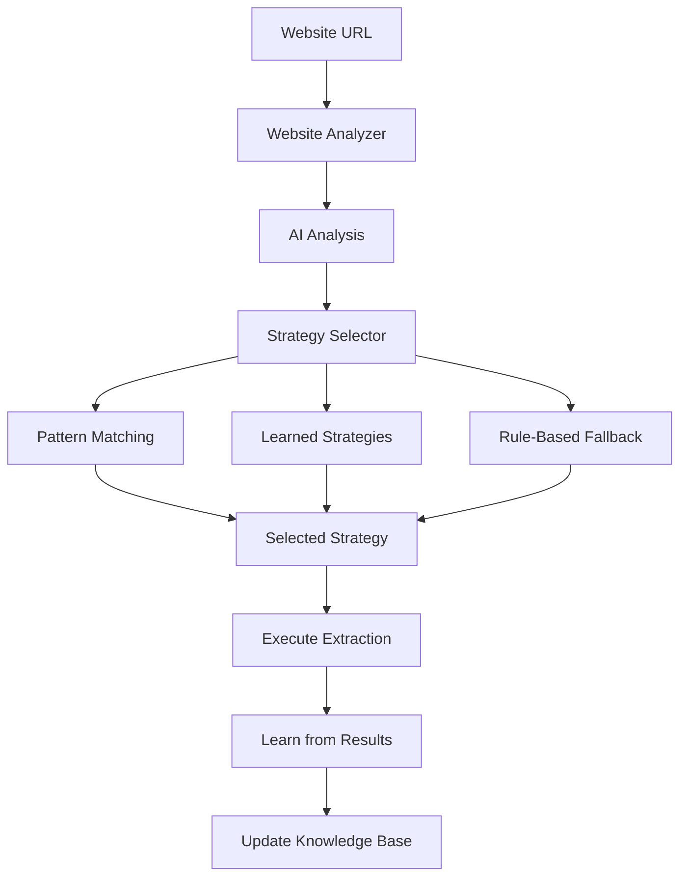

# Strategy Selection Guide

## Overview

The Intelligent Crawl4AI Agent uses AI-powered strategy selection to automatically choose the optimal extraction approach for any website. This guide explains how the strategy system works, available strategies, and how to customize extraction approaches.

## Table of Contents

- [Strategy Architecture](#strategy-architecture)
- [Available Strategies](#available-strategies)
- [AI-Powered Selection](#ai-powered-selection)
- [Strategy Configuration](#strategy-configuration)
- [Custom Strategies](#custom-strategies)
- [Performance Optimization](#performance-optimization)
- [Learning and Adaptation](#learning-and-adaptation)
- [Troubleshooting Strategies](#troubleshooting-strategies)

## Strategy Architecture

### How Strategy Selection Works



### Strategy Types

1. **CSS Strategies** - Fast, reliable for static content
2. **LLM Strategies** - Intelligent, handles complex content
3. **Hybrid Strategies** - Combines CSS and LLM approaches
4. **Platform Strategies** - Specialized for specific sites
5. **Specialized Strategies** - Custom implementations

## Available Strategies

### 1. CSS-Based Strategies

#### DirectoryCSSStrategy
**Best for**: Business directories, listing pages
```python
# Automatically detects and extracts:
{
    "businesses": [
        {
            "name": "Acme Corp",
            "address": "123 Main St, City, State",
            "phone": "(555) 123-4567",
            "website": "https://acmecorp.com",
            "email": "info@acmecorp.com",
            "rating": "4.5 stars",
            "category": "Technology"
        }
    ]
}
```

**Confidence Indicators**:
- Multiple business listings on page
- Directory-style layouts
- Structured contact information
- Business cards or tiles

#### EcommerceCSSStrategy
**Best for**: Product pages, online stores
```python
# Extracts product information:
{
    "products": [
        {
            "name": "Premium Widget",
            "price": "$99.99",
            "description": "High-quality widget for professionals",
            "image": "https://store.com/images/widget.jpg",
            "rating": "4.8/5",
            "availability": "In Stock",
            "brand": "TechCorp",
            "sku": "WID-001"
        }
    ]
}
```

**Confidence Indicators**:
- Price elements present
- Product images
- Add to cart functionality
- Product structured data

#### NewsCSSStrategy
**Best for**: News sites, articles, blogs
```python
# Extracts article content:
{
    "headline": "Breaking: Major Technology Breakthrough",
    "author": "Jane Smith",
    "publish_date": "2024-01-15",
    "content": "Full article content...",
    "summary": "Brief article summary",
    "category": "Technology",
    "tags": ["innovation", "technology", "breakthrough"]
}
```

**Confidence Indicators**:
- Article structured data
- Time elements
- Author information
- News-style layouts

#### ContactCSSStrategy
**Best for**: Contact discovery on any website
```python
# Finds all contact information:
{
    "emails": ["info@company.com", "support@company.com"],
    "phones": ["+1-555-123-4567", "(555) 987-6543"],
    "addresses": ["123 Business Ave, City, State 12345"],
    "social_links": [
        "https://linkedin.com/company/acme",
        "https://twitter.com/acmecorp"
    ],
    "contact_forms": ["https://company.com/contact"]
}
```

**Confidence Indicators**:
- Email/phone patterns in content
- Contact page elements
- Social media links
- Contact forms

#### SocialMediaCSSStrategy
**Best for**: Social media profiles
```python
# Extracts profile information:
{
    "name": "John Doe",
    "title": "Senior Software Engineer",
    "company": "TechCorp Inc.",
    "location": "San Francisco, CA",
    "bio": "Passionate about building scalable systems...",
    "followers": "1,234",
    "avatar": "https://platform.com/avatars/johndoe.jpg"
}
```

**Platform Support**:
- LinkedIn profiles
- Twitter/X profiles  
- Facebook pages
- Instagram profiles
- YouTube channels

### 2. LLM-Based Strategies

#### IntelligentLLMStrategy
**Best for**: Complex content requiring understanding
```python
# Uses AI to understand and extract:
{
    "extracted_data": {
        "key_insights": ["Market analysis", "Growth trends"],
        "entities": ["Company A", "Product X", "Q4 2024"],
        "relationships": {
            "Company A": "manufactures Product X",
            "Product X": "launched in Q4 2024"
        }
    },
    "confidence_score": 0.92
}
```

**Advantages**:
- Understands context and meaning
- Handles dynamic content
- Extracts relationships
- Works with any content type

**When to Use**:
- Complex business documents
- Research reports
- Legal documents
- Technical specifications

### 3. Hybrid Strategies

#### SmartHybridStrategy
**Best for**: Unknown or complex websites
```python
# Combines CSS speed with LLM intelligence:
{
    "extraction_method": "hybrid",
    "css_results": {
        "structured_data": "Fast CSS extraction"
    },
    "llm_enhancement": {
        "context": "AI-enhanced understanding",
        "relationships": "Extracted connections"
    },
    "confidence_score": 0.88
}
```

**Process**:
1. First attempts CSS extraction
2. LLM validates and enhances results
3. Falls back to pure LLM if CSS fails
4. Learns optimal approach for similar sites

### 4. Platform-Specific Strategies

#### LinkedInStrategy
**Specialized for**: LinkedIn profiles and company pages
```python
{
    "profile_type": "professional",
    "name": "Jane Smith",
    "current_position": "VP of Engineering at TechCorp",
    "experience": [
        {
            "title": "VP of Engineering",
            "company": "TechCorp",
            "duration": "2020 - Present"
        }
    ],
    "education": ["MIT Computer Science"],
    "connections": "500+",
    "skills": ["Python", "Leadership", "Architecture"]
}
```

#### AmazonStrategy
**Specialized for**: Amazon product pages
```python
{
    "asin": "B08X123456",
    "title": "Premium Product Name",
    "price": "$29.99",
    "prime_eligible": true,
    "rating": 4.5,
    "review_count": 1234,
    "availability": "In Stock",
    "seller": "Amazon",
    "variants": ["Color", "Size"],
    "specifications": {...}
}
```

### 5. Specialized Strategies

#### RegexExtractionStrategy
**Best for**: Fast pattern-based extraction
```python
# Ultra-fast extraction for known patterns:
{
    "emails": ["extracted@email.com"],
    "phones": ["+1-555-123-4567"],
    "urls": ["https://website.com"],
    "ips": ["192.168.1.1"],
    "execution_time": 0.05  # 50ms - 20x faster than other methods
}
```

**Use Cases**:
- Contact discovery
- URL extraction
- Data validation
- Log analysis

#### FormExtractionStrategy
**Best for**: Web forms and input detection
```python
{
    "forms": [
        {
            "action": "/submit-contact",
            "method": "POST",
            "fields": [
                {"name": "email", "type": "email", "required": true},
                {"name": "message", "type": "textarea", "required": true}
            ]
        }
    ],
    "automation_possible": true
}
```

#### CosineExtractionStrategy
**Best for**: Semantic content similarity
```python
{
    "similar_content": [
        {
            "text": "Related content block",
            "similarity_score": 0.85,
            "semantic_category": "product_description"
        }
    ],
    "content_clusters": {
        "main_content": ["paragraph1", "paragraph2"],
        "sidebar": ["nav_item1", "nav_item2"]
    }
}
```

## AI-Powered Selection

### Selection Process

1. **Website Analysis**
   ```python
   analysis = {
       "website_type": "e_commerce",
       "has_javascript": True,
       "frameworks": ["React"],
       "content_patterns": ["product_listings"],
       "estimated_complexity": "medium"
   }
   ```

2. **Strategy Recommendation**
   ```python
   recommendation = {
       "primary_strategy": "EcommerceCSSStrategy",
       "fallback_strategies": ["LLMStrategy"],
       "confidence": 0.85,
       "reasoning": "E-commerce indicators detected with structured product data"
   }
   ```

3. **Execution and Learning**
   ```python
   result = {
       "success": True,
       "extracted_data": {...},
       "strategy_used": "EcommerceCSSStrategy",
       "performance": "High confidence, fast execution"
   }
   ```

### Selection Criteria

#### Website Type Detection
- **Directory**: Multiple business listings, contact patterns
- **E-commerce**: Product information, pricing, cart functionality
- **News**: Articles, timestamps, author information
- **Corporate**: Company information, about pages
- **Social Media**: Profiles, social elements, user content

#### Technical Analysis
- **JavaScript Framework**: React, Vue, Angular detection
- **Content Loading**: Static vs dynamic content
- **Anti-bot Measures**: Cloudflare, CAPTCHAs
- **Structured Data**: JSON-LD, microdata presence

#### Content Patterns
- **Contact Information**: Emails, phones, addresses
- **Product Data**: Names, prices, descriptions
- **Profile Information**: Names, titles, bios
- **Article Content**: Headlines, text, metadata

## Strategy Configuration

### Global Configuration

```python
# config/strategy_config.py
STRATEGY_SETTINGS = {
    "default_strategy": "smart_hybrid",
    "confidence_threshold": 0.7,
    "enable_learning": True,
    "fallback_enabled": True,
    "max_execution_time": 60,
    "retry_failed_strategies": True
}
```

### Per-Strategy Configuration

```python
# CSS Strategy Settings
CSS_STRATEGY_CONFIG = {
    "timeout": 15,
    "max_selectors": 10,
    "require_multiple_matches": True,
    "selector_priority": ["id", "class", "data-*", "tag"]
}

# LLM Strategy Settings  
LLM_STRATEGY_CONFIG = {
    "model": "llama3.1",
    "max_tokens": 2000,
    "temperature": 0.1,
    "timeout": 60,
    "enable_schema_validation": True
}
```

### Purpose-Based Configuration

```python
PURPOSE_STRATEGIES = {
    "company_info": {
        "preferred": ["DirectoryCSSStrategy", "ContactCSSStrategy"],
        "fallback": ["IntelligentLLMStrategy"],
        "confidence_threshold": 0.8
    },
    "contact_discovery": {
        "preferred": ["ContactCSSStrategy", "RegexExtractionStrategy"],
        "fallback": ["IntelligentLLMStrategy"],
        "enable_fast_mode": True
    },
    "product_data": {
        "preferred": ["EcommerceCSSStrategy"],
        "fallback": ["IntelligentLLMStrategy"],
        "require_price": True
    }
}
```

## Custom Strategies

### Creating Custom Strategies

```python
from src.strategies.base_strategy import BaseExtractionStrategy, StrategyResult

class CustomWebsiteStrategy(BaseExtractionStrategy):
    """Custom strategy for specific website patterns"""
    
    def __init__(self, **kwargs):
        super().__init__(strategy_type=StrategyType.CSS, **kwargs)
        
        # Define custom selectors
        self.selectors = {
            "title": ".custom-title, h1.special",
            "content": ".content-area .main-text",
            "metadata": ".meta-info span"
        }
    
    async def extract(self, url: str, html_content: str, 
                     purpose: str, context: Dict[str, Any] = None) -> StrategyResult:
        """Custom extraction logic"""
        
        # Your extraction implementation
        extracted_data = self._extract_with_selectors(html_content)
        
        return StrategyResult(
            success=bool(extracted_data),
            extracted_data=extracted_data,
            confidence_score=self._calculate_confidence(extracted_data),
            strategy_used="CustomWebsiteStrategy",
            execution_time=execution_time,
            metadata={"custom_field": "value"}
        )
    
    def supports_purpose(self, purpose: str) -> bool:
        return purpose in ["custom_extraction", "special_content"]
    
    def get_confidence_score(self, url: str, html_content: str, purpose: str) -> float:
        # Custom confidence calculation
        if "special-marker" in html_content:
            return 0.9
        return 0.1
```

### Registering Custom Strategies

```python
# Register in strategy selector
from src.agents.strategy_selector import StrategySelector

# Add to strategy registry
StrategySelector.register_strategy("custom_website", CustomWebsiteStrategy)

# Use in configuration
CUSTOM_STRATEGY_MAPPING = {
    "special-website.com": "custom_website",
    "*.special-domain.com": "custom_website"
}
```

## Performance Optimization

### Strategy Performance Comparison

| Strategy Type | Speed | Accuracy | Resource Usage | Best For |
|---------------|-------|----------|----------------|----------|
| Regex | ⭐⭐⭐⭐⭐ | ⭐⭐⭐ | ⭐⭐⭐⭐⭐ | Simple patterns |
| CSS | ⭐⭐⭐⭐ | ⭐⭐⭐⭐ | ⭐⭐⭐⭐ | Structured sites |
| LLM | ⭐⭐ | ⭐⭐⭐⭐⭐ | ⭐⭐ | Complex content |
| Hybrid | ⭐⭐⭐ | ⭐⭐⭐⭐⭐ | ⭐⭐⭐ | Unknown sites |

### Optimization Strategies

#### Fast Mode Configuration
```python
FAST_MODE_CONFIG = {
    "enable_regex_first": True,
    "css_timeout": 10,  # Reduced timeout
    "skip_llm_fallback": False,
    "cache_selectors": True,
    "parallel_extraction": True
}
```

#### High-Volume Optimization
```python
HIGH_VOLUME_CONFIG = {
    "batch_size": 100,
    "concurrent_extractions": 20,
    "cache_strategies": True,
    "reuse_browser_sessions": True,
    "optimize_selectors": True
}
```

#### Memory-Efficient Settings
```python
MEMORY_EFFICIENT_CONFIG = {
    "cleanup_after_extraction": True,
    "limit_html_size": "1MB",
    "disable_image_loading": True,
    "gc_after_batch": True
}
```

## Learning and Adaptation

### How the System Learns

1. **Strategy Success Tracking**
   ```python
   learning_data = {
       "url": "example.com",
       "website_type": "e_commerce", 
       "strategy_used": "EcommerceCSSStrategy",
       "success_rate": 0.95,
       "extraction_quality": 0.88,
       "execution_time": 2.3
   }
   ```

2. **Pattern Recognition**
   - Similar website detection
   - Selector effectiveness tracking
   - Content pattern learning
   - Performance optimization

3. **Continuous Improvement**
   - Strategy rankings update
   - Selector refinement
   - Confidence calibration
   - Error pattern analysis

### Learning Configuration

```python
LEARNING_CONFIG = {
    "enable_learning": True,
    "learning_rate": 0.1,
    "min_samples_for_learning": 10,
    "confidence_update_threshold": 0.05,
    "retention_period_days": 90
}
```

## Troubleshooting Strategies

### Common Issues

#### Low Confidence Scores
```bash
# Check strategy selection logs
tail -f logs/strategy_selection.log | grep "confidence"

# Adjust confidence threshold
STRATEGY_CONFIDENCE_THRESHOLD=0.6  # Lower threshold
```

#### Strategy Selection Failures
```bash
# Force specific strategy
USE_STRATEGY=DirectoryCSSStrategy

# Enable strategy debugging
STRATEGY_DEBUG=true
LOG_LEVEL=DEBUG
```

#### Performance Issues
```bash
# Check strategy execution times
grep "execution_time" logs/performance.log

# Enable fast mode
ENABLE_FAST_MODE=true
SKIP_HEAVY_STRATEGIES=true
```

### Debugging Tools

#### Strategy Test Tool
```bash
# Test strategy selection
python scripts/test_strategy.py --url "https://example.com" --purpose "company_info"

# Output:
# Strategy: DirectoryCSSStrategy
# Confidence: 0.85
# Reasoning: Directory patterns detected
```

#### Performance Profiler
```bash
# Profile strategy performance
python scripts/profile_strategies.py --batch-size 100

# Output:
# CSS Strategies: 1.2s avg
# LLM Strategies: 8.5s avg  
# Hybrid: 3.8s avg
```

### Strategy Monitoring

#### Key Metrics
- **Success Rate**: Percentage of successful extractions
- **Confidence Score**: Average confidence of selections
- **Execution Time**: Average time per extraction
- **Error Rate**: Percentage of failed extractions

#### Monitoring Dashboard
```bash
# View metrics in Grafana
http://localhost:3000/d/strategies

# Key panels:
# - Strategy success rates
# - Execution time distribution
# - Confidence score trends
# - Error analysis
```

## Best Practices

### Strategy Selection
1. **Test strategies** on sample URLs before high-volume jobs
2. **Monitor confidence scores** and adjust thresholds
3. **Use purpose-specific** configurations
4. **Enable learning** to improve over time
5. **Set appropriate timeouts** for your use case

### Performance
1. **Use regex strategies** for simple pattern extraction
2. **Enable caching** for repeated similar sites
3. **Batch similar URLs** together
4. **Monitor resource usage** during high-volume processing
5. **Adjust worker counts** based on strategy types

### Reliability
1. **Always configure fallback** strategies
2. **Set reasonable timeouts** for each strategy type
3. **Monitor error rates** and adjust accordingly
4. **Test custom strategies** thoroughly
5. **Keep learning data** for analysis

## Advanced Topics

### Multi-Strategy Workflows
```python
# Execute multiple strategies in parallel
workflow = {
    "primary": "EcommerceCSSStrategy",
    "secondary": ["ContactCSSStrategy", "RegexExtractionStrategy"],
    "merge_results": True,
    "conflict_resolution": "highest_confidence"
}
```

### Conditional Strategy Logic
```python
# Use different strategies based on conditions
strategy_rules = {
    "if": {"domain": "*.amazon.com"},
    "then": {"strategy": "AmazonStrategy"},
    "else": {"strategy": "EcommerceCSSStrategy"}
}
```

### Strategy Pipelines
```python
# Chain strategies for complex extraction
pipeline = [
    {"strategy": "RegexExtractionStrategy", "purpose": "contact_discovery"},
    {"strategy": "DirectoryCSSStrategy", "purpose": "business_info"},
    {"strategy": "LLMStrategy", "purpose": "content_analysis", "input": "previous_results"}
]
```

This comprehensive guide should help you understand and effectively use the strategy system. For more specific implementation details, check the source code in `src/strategies/`.